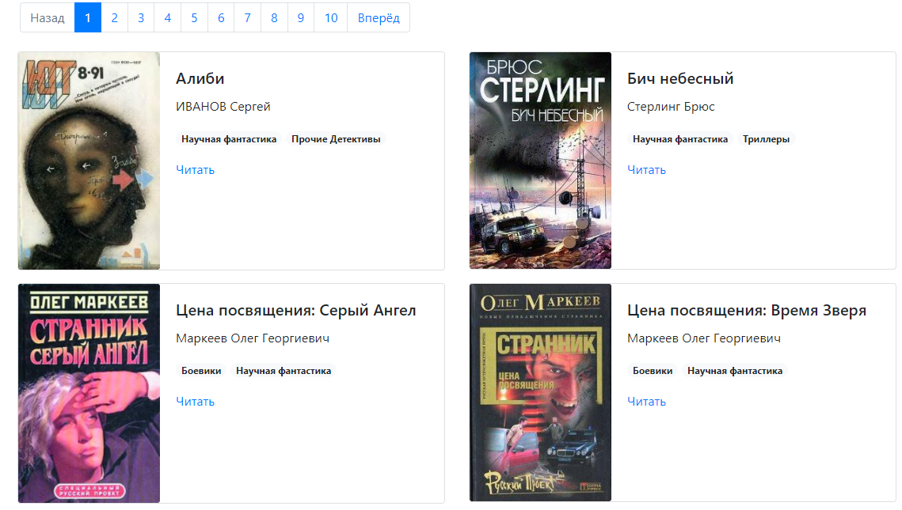

# Офлайн библиотека

Позволяет пополнить свою электронную библиотеку более чем 100 книгами. 


[Демка сайта](https://taranovev.github.io/book_site/).  



## Запуск

- Скачайте код (Необходимая версия Python 3.9)
- Установите зависимости командой:
  ```
  pip install -r requirements.txt
   ```

- Из директории, где расположен `render_website.py`, запустите скрипт командой:
  ```
  python render_website.py
  ```
 и перейдите по ссылке `http://127.0.0.1:5500/`(если страница пустая-нажмите обновить страницу)

[Данный проект является продолжением проекта]: (https://github.com/TaranovEV/e-library)
